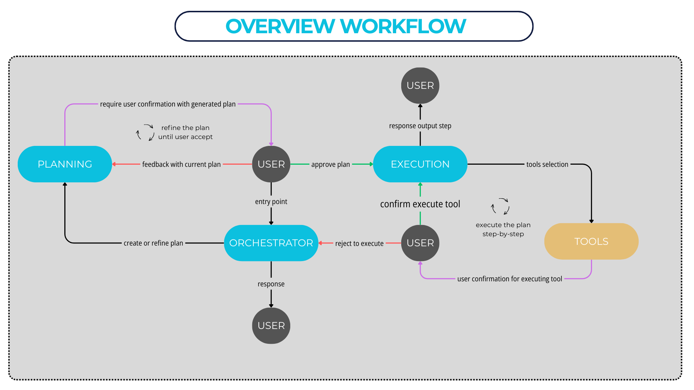

# Human In The Loop Agent with MCP

> ⚠️ NOTE: This README content was generated with assistance from an AI. Please review and verify all sections for accuracy and update project-specific details as needed.

A sophisticated AI agent system that combines LangGraph orchestration with Model Context Protocol (MCP) servers to provide human-in-the-loop capabilities for complex task execution. The system features a multi-node architecture with planning, execution, and response phases, all wrapped in an intuitive Streamlit interface.

## 🌟 Features

- **Human-in-the-Loop Workflow**: Interactive agent that can pause execution to request human input and approval
- **LangGraph State Management**: Sophisticated state management using LangGraph for complex multi-step processes
- **MCP Integration**: Seamless integration with Model Context Protocol servers for extensible tool capabilities
- **Multi-Interface Support**: Both FastAPI REST endpoints and Streamlit web interface
- **Modular Architecture**: Clean separation of concerns with dedicated nodes for orchestration, planning, execution, and response
- **Real-time Communication**: Server-Sent Events (SSE) for real-time updates in the Streamlit UI
- **Configurable LLM Backend**: Support for OpenAI GPT models with easy configuration

## 🏗️ Architecture



### System Components

```
┌─────────────────┐    ┌─────────────────┐    ┌─────────────────┐
│   Streamlit UI  │    │   FastAPI API   │    │   MCP Servers   │
│                 │◄──►│                 │◄──►│                 │
│  - Chat Interface   │    │  - REST Endpoints  │    │  - Math Server     │
│  - Plan Display    │    │  - SSE Streaming   │    │  - Custom Tools    │
│  - Human Input     │    │  - CORS Support    │    │  - HTTP Transport  │
└─────────────────┘    └─────────────────┘    └─────────────────┘
                                │
                                ▼
                       ┌─────────────────┐
                       │   LangGraph     │
                       │   Orchestrator  │
                       │                 │
                       │  ┌─────────────┐ │
                       │  │ Orchestrate │ │
                       │  └─────────────┘ │
                       │         │        │
                       │  ┌─────────────┐ │
                       │  │    Plan     │ │
                       │  └─────────────┘ │
                       │         │        │
                       │  ┌─────────────┐ │
                       │  │  Execute    │ │
                       │  └─────────────┘ │
                       │         │        │
                       │  ┌─────────────┐ │
                       │  │  Response   │ │
                       │  └─────────────┘ │
                       └─────────────────┘
```

### Node Architecture

- **Orchestrate Node**: Routes requests to appropriate processing nodes based on context
- **Plan Node**: Generates execution plans for complex tasks requiring human oversight
- **Execute Node**: Executes approved plans using available MCP tools
- **Response Node**: Formats and delivers final responses to users

## 🚀 Quick Start

### Prerequisites

- Python 3.10+
- OpenAI API key
- Git

### Installation

1. **Clone the repository**
   ```bash
   git clone <repository-url>
   cd HumanInTheLoopAgent
   ```

2. **Create virtual environment**
   ```bash
   python -m venv venv
   source venv/bin/activate  # On Windows: venv\Scripts\activate
   ```

3. **Install dependencies**
   ```bash
   pip install -r requirements.txt
   ```

4. **Environment Configuration**
   Create a `.env` file in the root directory:
   ```env
   OPENAI_API_KEY=your_openai_api_key_here
   ...
   ```

## 🏃‍♂️ Running the Application

### Option 1: Full Stack (Recommended)

1. **Start MCP Server** (Terminal 1):
   ```bash
   python MCP/servers/math/server.py
   ```

2. **Start FastAPI Server** (Terminal 2):
   ```bash
   python app.py
   ```

3. **Launch Streamlit UI** (Terminal 3):
   ```bash
   streamlit run streamlit_app.py
   ```

### Option 2: API Only

Start just the FastAPI server for API-only usage:
```bash
python app.py
```

Access the API documentation at: `http://localhost:8000/docs`

## 🖥️ Usage

### Streamlit Web Interface

1. Navigate to `http://localhost:8501`
2. Enter your query in the chat interface
3. Watch as the agent orchestrates the workflow
4. Provide human input when prompted
5. Review execution plans before approval
6. Receive final responses

### API Endpoints

#### Stream Chat Endpoint
```bash
POST /api/v1/astream
Content-Type: application/json
```

## 🔧 Configuration

### Environment Variables

| Variable | Description | Default |
|----------|-------------|---------|
| `OPENAI_API_KEY` | OpenAI API key (required) | - |
| `LLM_MODEL` | OpenAI model to use | `gpt-4-mini` |
| `MCP_SERVER_CONFIGS_PATH` | Path to MCP server config | `MCP/mcp_server_config.json` |
| `APP_NAME` | Application name | `Human In The Loop Agent` |
| `APP_VERSION` | Application version | `1.0.0` |
| `DEBUG` | Enable debug mode | `false` |

### MCP Server Configuration

Edit `MCP/mcp_server_config.json` to configure MCP servers:

```json
{
  "math": {
    "url": "http://localhost:3111/mcp",
    "transport": "streamable_http"
  },
  "custom_server": {
    "url": "http://localhost:3112/mcp",
    "transport": "streamable_http"
  }
}
```

## 📁 Project Structure

```
HumanInTheLoopAgent/
├── agent/                  # Core agent logic
│   ├── graphs/            # LangGraph workflow definitions
│   ├── nodes/             # Individual processing nodes
│   └── states/            # State management classes
├── app/                   # FastAPI application
│   ├── api/v1/           # API version 1 endpoints
│   └── schemas/          # Pydantic models
├── MCP/                   # Model Context Protocol integration
│   ├── clients/          # MCP client management
│   └── servers/          # MCP server implementations
├── utils/                 # Utility functions
├── app.py                # FastAPI application entry point
├── streamlit_app.py      # Streamlit UI application
├── config.py             # Configuration management
└── requirements.txt      # Python dependencies
```

## 🛠️ Development

### Adding New MCP Servers

1. Create server implementation in `MCP/servers/your_server/`
2. Add server config to `MCP/mcp_server_config.json`
3. Restart the MCP client manager

### Extending Node Functionality

1. Add new nodes in `agent/nodes/`
2. Update the workflow in `agent/graphs/orchestrator.py`
3. Modify state classes in `agent/states/` if needed

### Custom Tool Integration

Tools are automatically discovered from configured MCP servers. Ensure your MCP server properly exposes tools according to the MCP specification.

## 🧪 Testing

Run the development notebook:
```bash
jupyter notebook dev.ipynb
```

## 📝 API Documentation

Once the FastAPI server is running, visit:
- Interactive API docs: `http://localhost:8000/docs`
- OpenAPI schema: `http://localhost:8000/openapi.json`

## 🐛 Troubleshooting

### Common Issues

1. **MCP Server Connection Failed**
   - Ensure MCP servers are running before starting the main application
   - Check server URLs in `mcp_server_config.json`
   - Verify no port conflicts

2. **OpenAI API Errors**
   - Verify `OPENAI_API_KEY` is set correctly
   - Check API key permissions and usage limits
   - Ensure the specified model is available

3. **Streamlit Not Loading**
   - Check if FastAPI server is running on port 8000
   - Verify no firewall blocking connections
   - Clear browser cache and try again

### Logs

The application uses Loguru for logging. Check console output for detailed error messages and debugging information.

## 🤝 Contributing

1. Fork the repository
2. Create a feature branch
3. Make your changes
4. Add tests if applicable
5. Submit a pull request

## 📄 License

This project is licensed under the MIT License - see the LICENSE file for details.

## 🙏 Acknowledgments

- [LangGraph](https://github.com/langchain-ai/langgraph) for workflow orchestration
- [Model Context Protocol](https://modelcontextprotocol.io/) for tool integration
- [Streamlit](https://streamlit.io/) for the web interface
- [FastAPI](https://fastapi.tiangolo.com/) for the REST API framework